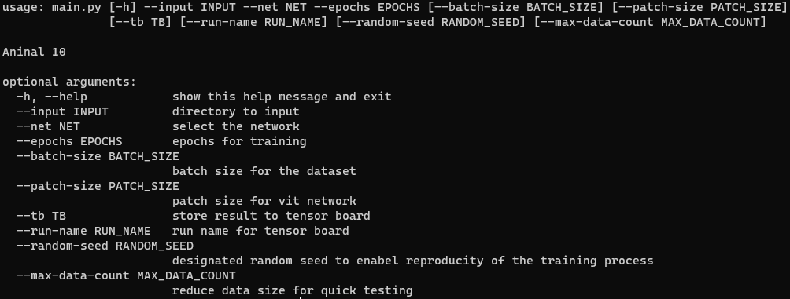

# Animal 10
This project is training the [Animal 10 Dataset](https://www.kaggle.com/alessiocorrado99/animals10)
made by Allen Lin <weitung8@gmail.com>

## Usage

### Install Dependencies
```sh
pip install -r requirements.txt
```

### Download input images
* go to [animal 10](https://www.kaggle.com/alessiocorrado99/animals10)
* download the dataset
* unzip

### Train the model


### Networks
* ViT
* ViT-Pretrained
* Baseline
* CNN (deeper baseline)

## Accuracy
* ViT ~60% (only 10 epochs)
* ViT-Pretrained ~75% (only 10 epochs)
* Baseline ~70%
* CNN ~75%

## Tensorboard
```sh
tensorboard --logdir runs
```

open [Tensorboard](http://localhost:6006) for complete result (training loss, train/test acc., confusion matrix, input images, model architecture)

## Reference
* https://github.com/kentaroy47/vision-transformers-cifar10/blob/main/train_cifar10.py
* https://github.com/lucidrains/vit-pytorch
* https://github.com/google-research/vision_transformer